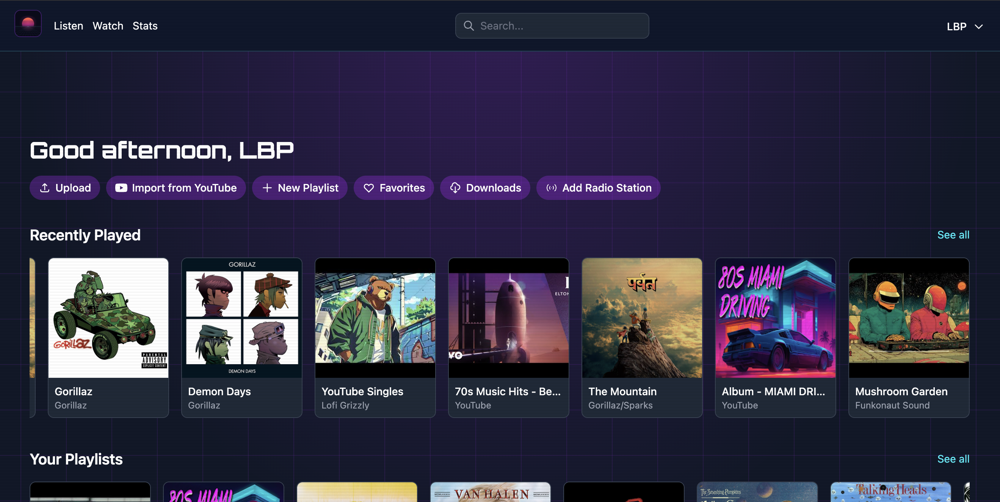
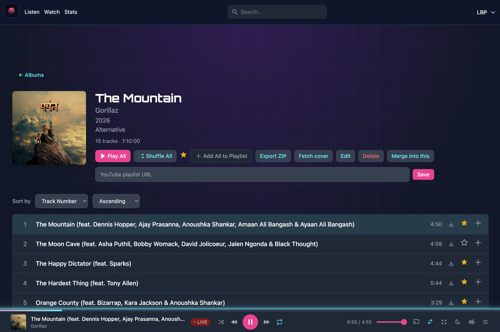
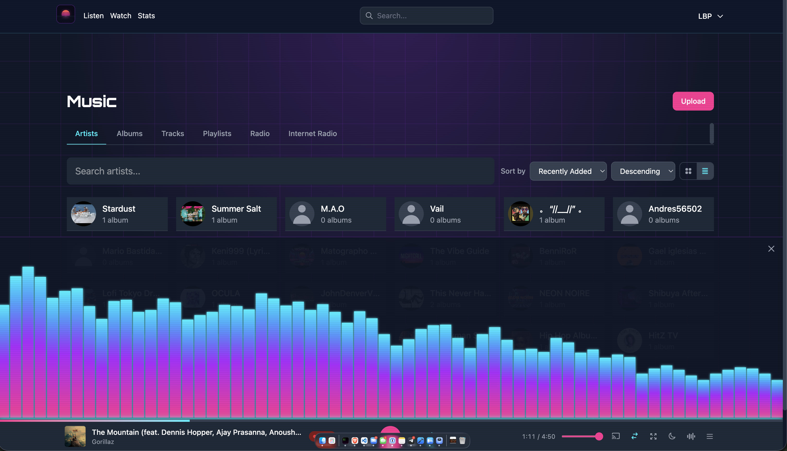
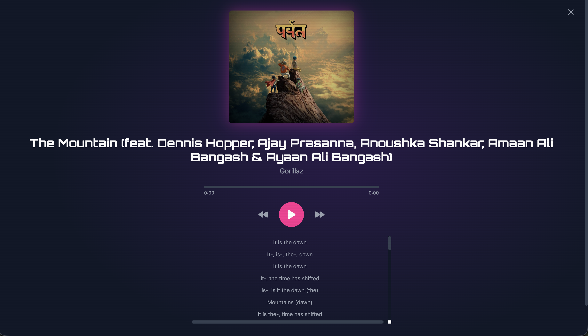
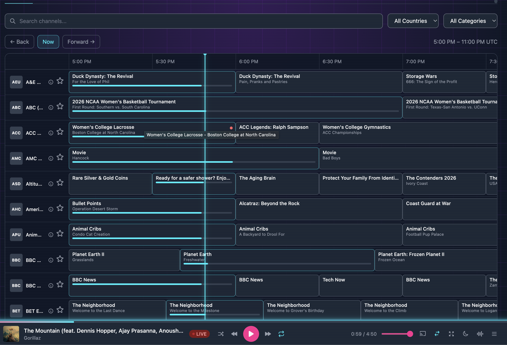
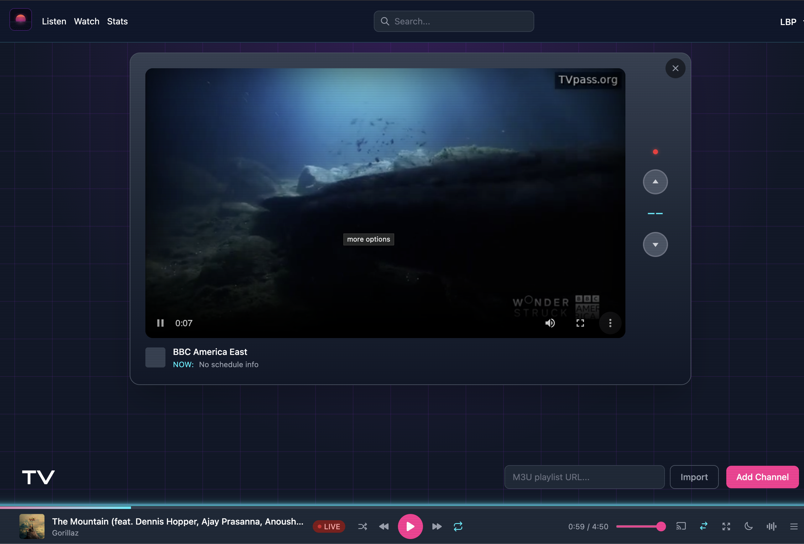
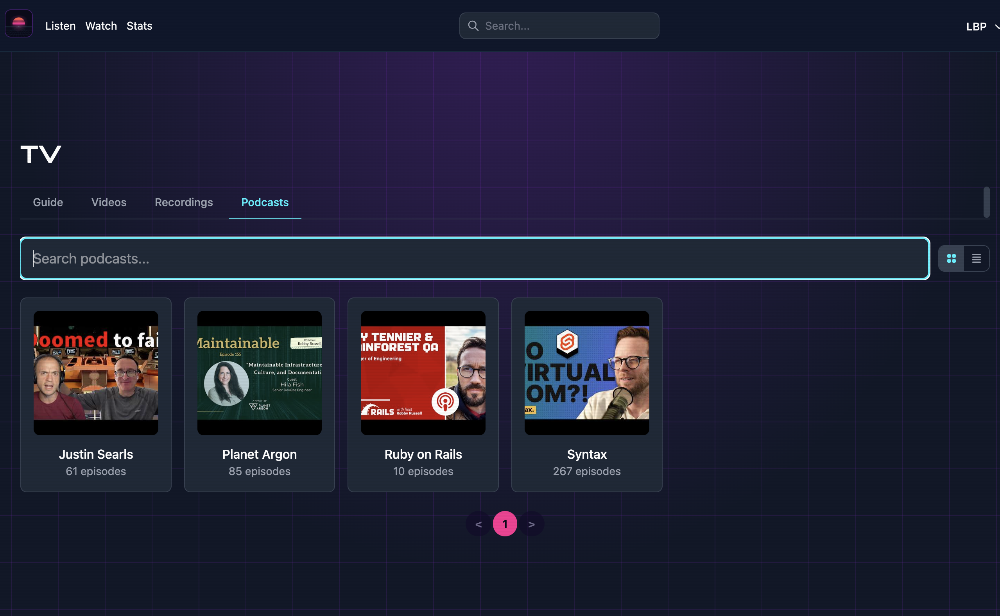

# synthwaves.fm

[](https://justin.searls.co/shovelware/)

Self-hosted music, video, live TV, DVR, radio, and podcast streaming for your personal library.


## What is synthwaves.fm?

synthwaves.fm is a self-hosted music and video streaming server built with Rails 8. Upload your media library, organize it by artist, album, and genre, and stream it from any device. Videos are automatically converted to H264/AAC/MP4 for broad compatibility. It also supports internet radio via the Radio Browser API, YouTube playlist imports, smart playlists, downloads, lyrics, and four switchable themes. It implements the Subsonic API so you can use your favorite dedicated music apps. The entire stack runs on SQLite — no Postgres, Redis, or external services required. It installs as a Progressive Web App for a native feel on any platform.

## Screenshots

|                                            |                                            |                                                    |
| ------------------------------------------ | ------------------------------------------ | -------------------------------------------------- |
|          |        |            |
|      |  |            |
|  |      |  |

## Features

### Music Library

- Browse by artist, album, track, or podcast
- Album pages with cover art and sortable track lists
- Full-text search with live dropdown suggestions
- Filter by genre, year range, tags, and favorites
- Automatic metadata extraction from uploaded audio files
- Lyrics fetched from LRClib (synced and plain text)
- Cover art search

### Player

- Full playback controls: play/pause, next/previous, seek, volume
- Shuffle and repeat modes (off / all / one)
- Persistent queue that survives page reloads and browser restarts
- Resume playback position across sessions
- Native OS media controls (lock screen, media keys) via MediaSession API

### Playlists & Favorites

- Create playlists and reorder tracks with drag-and-drop
- One-click playlist creation from any album
- Favorite any artist, album, or track
- Smart playlists: most played, recently added, unplayed, heavy rotation, deep cuts

### Video

- Upload and stream video files (mp4, mkv, avi, mov, and more)
- Organize videos into folders and series
- Playback position tracking across sessions
- Automatic conversion to H264/AAC/MP4 (hardware-accelerated on Apple Silicon)

### Radio

- Browse thousands of internet radio stations via the Radio Browser API
- Create radio stations from YouTube live streams
- Add custom stream URLs as radio stations

### YouTube Integration

- Import YouTube playlists as music or podcasts
- Search YouTube directly from the app (requires a per-user API key)
- Stream YouTube audio alongside your local library

### Downloads

- Export tracks, albums, playlists, or your entire library as ZIP files
- Real-time progress tracking via Turbo Streams
- Downloads are available for one hour after generation

### Themes

- Four music-genre-inspired themes: Synthwave, Reggae, Punk, Jazz
- Instant client-side switching with no page reload
- Theme preference synced to your account

### Playback Extras

- Sleep timer with configurable presets (15, 30, 60, 90, 120 minutes)
- Audio visualizer with theme-aware colors
- Keyboard shortcuts for hands-free control
- Picture-in-picture mode for video

### Casting

- AirPlay support for compatible speakers and devices
- Chromecast support

### Live TV

- Import IPTV channels from M3U playlists
- Electronic Program Guide (EPG) with schedules
- Record live streams
- Retro TV channel-surfing interface

### Listening Stats

- Dashboard with play counts, listening time, and streaks
- Filter by week, month, year, or all time

### Progressive Web App

- Install on mobile or desktop for a native app experience
- Standalone display mode with custom icons and dark theme

## Getting Started

**Requirements:** Ruby 4.0.1+, SQLite3, ffmpeg

**Optional:** yt-dlp (for YouTube downloads)

**Setup and run:**

```
bin/setup
```

This installs dependencies, prepares the database, and starts the server.

For subsequent launches:

```
bin/dev
```

**Default login:** admin@example.com / abc123

## Configuration

The app runs out of the box with no configuration for local development. For production and self-hosting, you'll want to configure storage and optionally enable YouTube features.

### S3-Compatible Storage (production)

Production deployments need an S3-compatible bucket for audio files, cover art, and video storage. In development, files are stored on local disk — no S3 needed.

Run `bin/rails credentials:edit --environment=production` and add your bucket credentials:

```yaml
linode:
  access_key_id: xxx
  secret_access_key: xxx
  region: us-east-1
  bucket: your-bucket
  endpoint: https://us-east-1.linodeobjects.com
```

This works with any S3-compatible provider (Linode, AWS, MinIO, DigitalOcean Spaces, etc.). For AWS S3 specifically, see the commented-out `amazon` service in [`config/storage.yml`](config/storage.yml).

### YouTube API Key

To search YouTube directly from the app, each user adds their own YouTube Data API v3 key in their profile settings. Without a key, users can still paste YouTube URLs directly.

Get a key from the [Google Cloud Console](https://console.cloud.google.com/) under APIs & Services, then enable the YouTube Data API v3.

### Rails Credentials

Manage with `bin/rails credentials:edit --environment=production`:

| Credential        | Purpose                  | Required?           |
| ----------------- | ------------------------ | ------------------- |
| `linode.*`        | S3 storage for uploads   | Yes, for production |
| `remote.*`        | Remote upload rake tasks | Only for rake tasks |
| `secret_key_base` | JWT signing, sessions    | Auto-generated      |

### Environment Variables

| Variable              | Purpose                           | Default |
| --------------------- | --------------------------------- | ------- |
| `RAILS_MASTER_KEY`    | Decrypt credentials in production | —       |
| `PORT`                | Server port                       | 3000    |
| `SOLID_QUEUE_IN_PUMA` | Run job queue in-process          | —       |
| `WEB_CONCURRENCY`     | Puma worker processes             | auto    |
| `RAILS_MAX_THREADS`   | Puma threads per worker           | 3       |
| `JOB_CONCURRENCY`     | Solid Queue workers               | 2       |

Most users will upload music and videos through the web UI. If you have an existing local library you'd like to bulk-import to a remote deployment, the rake tasks in the next section accept these optional variables:

| Variable     | Purpose                             | Default    |
| ------------ | ----------------------------------- | ---------- |
| `MUSIC_PATH` | Source directory for `library:push` | `~/Music`  |
| `VIDEO_PATH` | Source directory for `videos:push`  | `~/Movies` |

## Uploading Your Library

### Push Music

Upload a directory of audio files. Uses Rails credentials (`remote.*`) for authentication:

```
MUSIC_PATH=/path/to/music bundle exec rake library:push
```

`MUSIC_PATH` defaults to `~/Music`. Supported formats: mp3, flac, ogg, m4a, aac, wav, wma, opus, webm. Metadata and cover art are extracted automatically. Duplicate tracks are skipped.

### Push Playlists

Upload playlists from cliamp's TOML playlist files. Uses environment variables for authentication:

```
REMOTE_URL=https://your-instance.example.com \
REMOTE_CLIENT_ID=bc_xxxx \
REMOTE_SECRET_KEY=xxxx \
bundle exec rake playlists:push
```

Tracks are matched against your existing library by title, artist, and album.

### Push Videos

Upload a directory of video files. Uses Rails credentials (`remote.*`) for authentication:

```
VIDEO_PATH=/path/to/videos bundle exec rake videos:push
```

`VIDEO_PATH` defaults to `~/Movies`. Supported formats: mp4, mkv, avi, mov, m4v, wmv, flv, webm, ts. Videos are automatically converted to H264/AAC/MP4.

You can also upload tracks and videos through the web UI.

## APIs & Client Apps

| API          | Auth                       | Use Case                        |
| ------------ | -------------------------- | ------------------------------- |
| JWT REST API | `client_id` + `secret_key` | Building custom integrations    |
| Import API   | JWT bearer token           | Bulk uploading via rake tasks   |
| Subsonic API | Username + token/password  | Connecting dedicated music apps |

Full documentation is in [`docs/api/`](docs/api/).

### Subsonic-Compatible Apps

synthwaves.fm implements the Subsonic API, so you can connect dedicated music apps and stream your library from any platform. Compatible apps include DSub, play:Sub, Submariner, Clementine, Symfonium, and many more.

## Deployment

### Docker

A pre-built image is available on GitHub Container Registry. ffmpeg and yt-dlp are included.

```bash
docker pull ghcr.io/leopolicastro/synthwaves.fm:latest
docker run -d \
  -p 3000:80 \
  -e SOLID_QUEUE_IN_PUMA=true \
  -v synthwaves_fm_storage:/rails/storage \
  --name synthwaves_fm \
  ghcr.io/leopolicastro/synthwaves.fm:latest
```

Visit `http://localhost:3000` and log in with `admin@example.com` / `abc123`.

On first boot, the app auto-generates encryption credentials and saves them to the storage volume. All data — databases, uploads, and encryption keys — lives in the `synthwaves_fm_storage` volume. This volume persists across container restarts and image upgrades. Do not delete it.

To stop and restart:

```bash
docker stop synthwaves_fm
docker start synthwaves_fm
```

To build from source instead:

```bash
docker build -t synthwaves_fm .
docker run -d \
  -p 3000:80 \
  -e SOLID_QUEUE_IN_PUMA=true \
  -v synthwaves_fm_storage:/rails/storage \
  --name synthwaves_fm \
  synthwaves_fm
```

### Kamal

A [`config/deploy.yml`](config/deploy.yml) is included for deployment with [Kamal](https://kamal-deploy.org/).

## Development

`bin/dev` starts three processes: the Rails server, the Tailwind CSS watcher, and the Solid Queue worker.

```bash
bin/rspec              # Run test suite
bundle exec standardrb # Lint Ruby code
bundle exec brakeman   # Security scan
```

Admin panel at `/admin`. Job dashboard at `/jobs`.

## License

[MIT License](LICENSE.md)

---

Built with Rails 8, Hotwire, Tailwind CSS, and ViewComponent.
