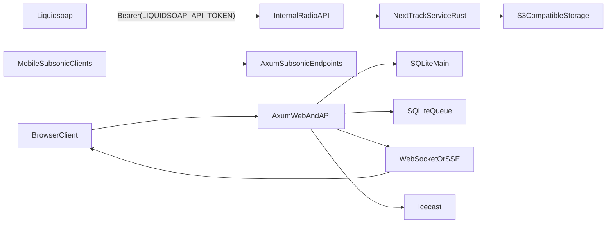

# Rust/Axum Big-Bang Rewrite Plan

## Target Architecture

- Build a single Rust service with Axum for routing, HTML rendering, APIs, and internal endpoints.
- Keep the existing infrastructure contracts where possible (Icecast/Liquidsoap, S3-compatible storage, SQLite deployment model) to reduce cutover risk.
- Replace Rails real-time behavior with Axum WebSocket/SSE streams for chat/download/radio status updates.

## Scope Baseline (from current app)

- Route/API surface to preserve from [config/routes.rb](config/routes.rb), including web resources, `/api/v1`, `/api/internal`, import APIs, and Subsonic routes (`draw :subsonic`).
- Auth parity:
  - Cookie sessions from [app/controllers/concerns/authentication.rb](app/controllers/concerns/authentication.rb)
  - JWT auth from [app/controllers/api/v1/base_controller.rb](app/controllers/api/v1/base_controller.rb)
  - Subsonic auth from [app/controllers/concerns/subsonic_authentication.rb](app/controllers/concerns/subsonic_authentication.rb)
- Radio/Liquidsoap parity from [app/services/liquidsoap_config_service.rb](app/services/liquidsoap_config_service.rb), [app/jobs/station_control_job.rb](app/jobs/station_control_job.rb), and [app/controllers/api/internal/base_controller.rb](app/controllers/api/internal/base_controller.rb).
- Theme parity from [app/models/concerns/themeable.rb](app/models/concerns/themeable.rb) and [app/assets/tailwind/application.css](app/assets/tailwind/application.css).
- Scheduler/job parity from [config/recurring.yml](config/recurring.yml) and current job classes in `app/jobs/`.

## Implementation Phases

### Phase 1: Foundation and Contracts Freeze

- Freeze external API contracts (Subsonic, JWT API, import API, internal radio API) and web route behavior from current Rails responses.
- Create Rust workspace layout (`axum-app`, `domain`, `infra`, `jobs`, `migrations`) and baseline observability/logging.
- Define core crate choices (Axum, SQLx/Diesel, Askama, Tokio, tracing, JWT, password hashing, multipart, object storage client).
- Produce a parity matrix listing each Rails endpoint/controller action and its Rust target handler.

### Phase 2: Data Layer and Auth Parity

- Port schema and migrations from existing SQLite model/table set (currently ~35 tables).
- Implement session cookies (`httponly`, `same_site=lax`) and session persistence behavior matching Rails.
- Implement JWT issue/verify path compatible with current `/api/v1/auth/token` flow.
- Implement Subsonic credential validation (token+salt MD5 and plaintext/hex password modes).

### Phase 3: Web UI + Template Migration (Server-rendered)

- Rebuild layouts/pages/components using Axum + templates, preserving URL structure and form semantics.
- Port essential client JS behavior first (player, queue, theme switching, global search, TV/video interactions) from `app/javascript/controllers/`.
- Recreate persistent player shell behavior that currently depends on Turbo permanence.
- Preserve current theme variable approach and profile theme update flow.

### Phase 4: Media and Background Processing

- Port upload/download/stream pipelines (tracks/videos/recordings/download zips), including ffmpeg and metadata extraction workflows.
- Recreate async job execution with retries, scheduling, and queue isolation equivalent to Solid Queue usage.
- Port recurring tasks from `config/recurring.yml`.
- Rebuild broadcast/progress updates using WebSockets/SSE for downloads, recordings, radio station status, and chat streaming.

### Phase 5: Radio Stack and Integrations

- Port internal radio endpoints and next-track selection logic.
- Recreate Liquidsoap config generation and mount/crossfade behavior exactly.
- Keep Icecast/Liquidsoap env/token contract unchanged to avoid infrastructure churn.
- Port integration services: S3-compatible storage, YouTube import/download, IPTV/EPG sync, lyrics, analytics events, AI chat.

### Phase 6: Admin + Cutover Readiness

- Build Axum admin interface replacing current Madmin capabilities needed in production.
- Run full parity test suite (API golden tests + smoke tests + streaming/radio checks + job/cron checks).
- Stage production-like rehearsal with full data copy and accessory services.
- Execute single cutover window with rollback artifacts prebuilt (last-known-good Rails image + DB snapshot + Liquidsoap config snapshot).

## Delivery Controls

- Contract tests first for all non-negotiable endpoints and auth modes.
- Feature-by-feature parity gates with explicit pass criteria before advancing phase.
- Canary rehearsal in staging using real accessories (Icecast, Liquidsoap, object storage).
- Production cutover checklist: migrations done, env parity validated, recurring jobs active, radio active endpoints green, real-time channels healthy.
